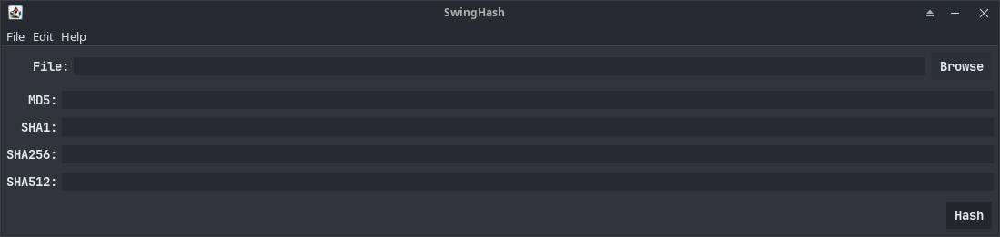
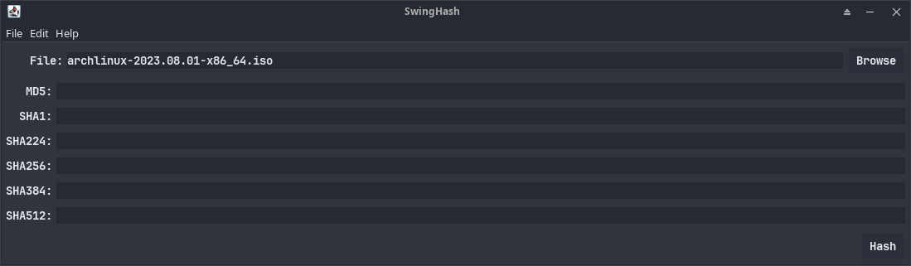
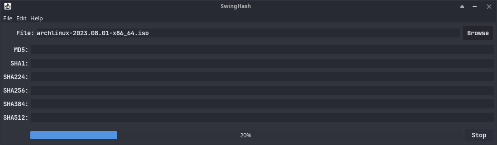
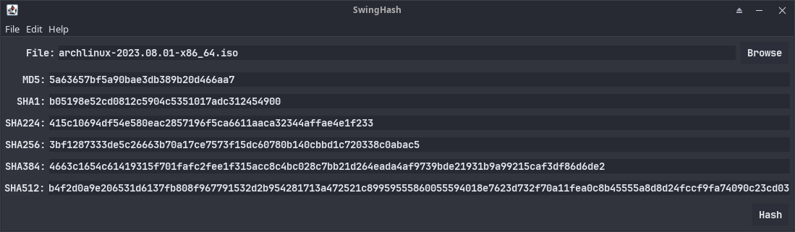

# SwingHash

SwingHash is a Java application that calculates checksums for files using a Swing-based graphical user interface (GUI).

## Overview

The purpose of this project is to provide a user-friendly way to calculate checksums for files. The application allows users to select files using a file chooser, choose the desired checksum algorithm, and view the calculated checksum values in the GUI.

## Features

- Choose a file through a file chooser.
- Select a checksum algorithm (e.g., MD5, SHA-1, SHA-256).
- Display calculated checksum values.
- GUI components built using Swing.

## Installation
    soon

## Screenshots

## Disclaimer

- This is my first software project